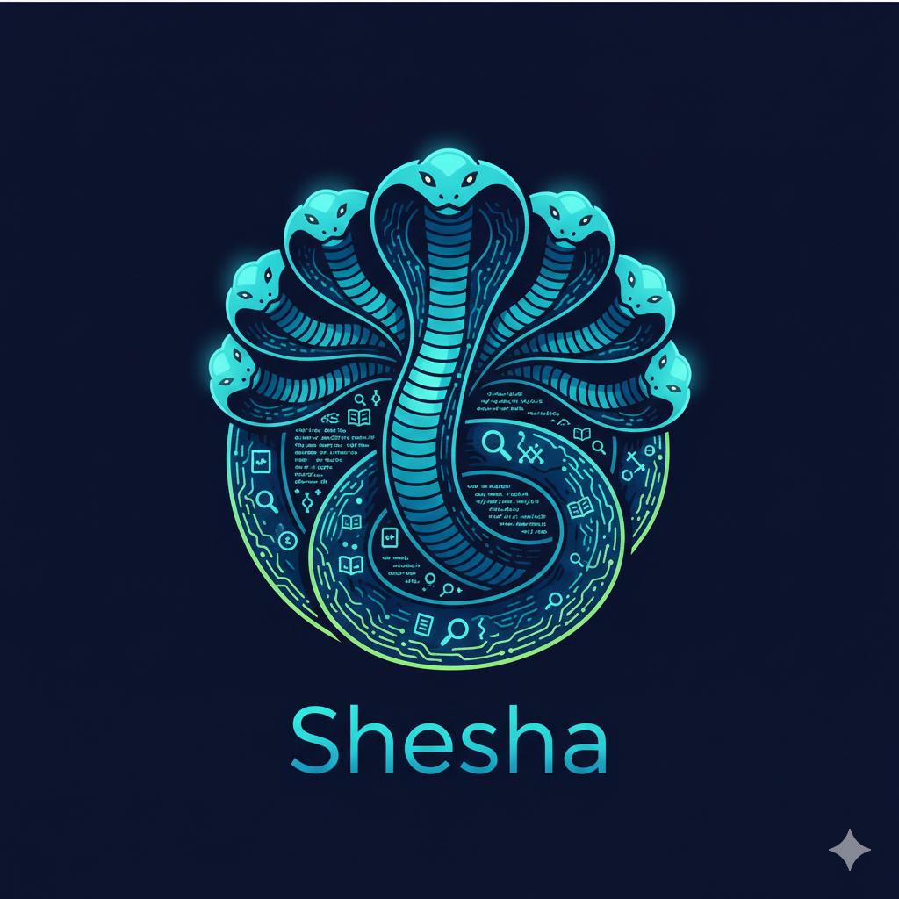

# Shesha

<p align="center">
  
</p>

**Ask complex questions across large document collections—and get answers with citations**

Shesha lets AI explore your documents, [even large codebases](examples/repo.py), the way a researcher would: reading, searching, cross-referencing, and iterating until it finds the answer. Unlike simple RAG that retrieves chunks, Shesha reasons across your entire corpus.

**Why this matters:** [Recursive Language Models (RLMs)](https://arxiv.org/abs/2512.24601) give LLMs effectively unlimited context and dramatically better long-horizon reasoning. The AI writes Python code to actively explore your documents in a secure sandbox, iterating until confident in the answer—no context window limits, no lost information.

---

## ⚡ Quick Start

**The simplest way to get started:**

```bash
# 1. Clone the repository
git clone https://github.com/l00p3rl00p/sheshaMajorMcp-rlm.git

# 2. Enter the project directory
cd sheshaMajorMcp-rlm

# 3. Install dependencies
pip install -e ".[dev]"

# 4. Run the installer
python -m shesha.librarian install
```

That’s it! The installer will fail fast with clear errors if Docker, Python 3.11+, or other required binaries are missing, ensuring the system is runnable before it finishes.

> **Installed users:** after `python -m shesha.librarian install`, keep Docker running and use:
>
> ```bash
> librarian bridge
> librarian gui
> ```

**Next Step**: Read [**docs/GETTING_STARTED.md**](./docs/GETTING_STARTED.md) to perform your first codebase research.

---

## 📋 Table of Contents

1. [What the Installer Does](#what-the-installer-does)
2. [Prerequisites](#prerequisites)
3. [Alpha Code Notice](#alpha-code-notice)
4. [Optional GUI (Operator Dashboard)](#optional-gui-operator-dashboard)
5. [Supported LLM Providers](#supported-llm-providers)
6. [Installation](#installation)
7. [Librarian (CLI + MCP Server)](#librarian-cli--mcp-server)
8. [Build the Sandbox Container](#build-the-sandbox-container)
9. [Configuration](#configuration)
10. [Quick Start Examples](#quick-start-examples)
11. [Try the Barsoom Example](#try-the-barsoom-example)
12. [Analyzing Codebases](#analyzing-codebases)
13. [How It Works](#how-it-works)
14. [Supported Document Formats](#supported-document-formats)
15. [Running Tests](#running-tests)
16. [Architecture & Development](#architecture--development)
17. [Project Structure](#project-structure)
18. [Sample Session](#sample-session)
19. [Security](#security)
20. [Who is Shesha?](#who-is-shesha)
21. [License](#license)
22. [Author](#author)

---

## What the Installer Does

The installer automates the complete setup process:

* **System Audit**: Verifies Python 3.11+ (exits with clear error if older) and checks if you're in a virtual environment (provides setup guidance if not).
* **Infrastructure Check**: Detects if Docker is running (required for secure code sandboxing).
* **Interactive Guidance**: If Docker is missing, provides platform-specific installation instructions (Docker Desktop, Homebrew, Colima) and lets you choose to install, skip, or abort.
* **Complete Setup**: Creates local storage/log directories and writes `.librarian/manifest.json` with your system status.

---

## Prerequisites

* **Python:** 3.11+
* **Docker:** Required for code execution; optional for indexing/management
* **LLM API Key:** Or local Ollama installation

---

## Alpha Code Notice

So far it seems to work, but it's only been tested with .txt documents and the OpenAI API. It _should_ support PDFs, Word Documents, and other files. Your mileage may vary.

---

## Startup Workflow

Before running the GUI, confirm the critical dependencies are running:

1. `Docker` must be started (Docker Desktop, Colima, or Podman). Install/launch before proceeding.
2. Run the bridge API, which proxies CLI commands:

```bash
python -m shesha.librarian bridge
```

   - The bridge listens on `http://127.0.0.1:8000` and exposes `/api/*` for the GUI.
3. Open the GUI (uses the same bridge key for authentication):

```bash
python -m shesha.librarian gui
```

   - This launches the browser pointing at `http://localhost:${LIBRARIAN_GUI_PORT:-3000}`.
   - If you prefer the Vite dev server, you can run it separately inside `gui/`:
     ```bash
     cd gui
     npm install
     npm run dev
     ```

   - The GUI health audit panel shows Docker, bridge, and manifest status and lets you recheck dependencies without leaving the UI.

## Optional GUI (Operator Dashboard)

The GUI is the operator dashboard and sits in the `gui/` folder:

```bash
cd gui
npm install
npm run dev
```

---

## Supported LLM Providers

Shesha uses [LiteLLM](https://github.com/BerriAI/litellm) under the hood, giving you access to 100+ LLM providers with a unified interface:

| Provider | Example Model | Environment Variable |
|----------|---------------|---------------------|
| **Anthropic** | `claude-sonnet-4-20250514` | `ANTHROPIC_API_KEY` |
| **OpenAI** | `gpt-4o`, `gpt-4-turbo` | `OPENAI_API_KEY` |
| **Google** | `gemini/gemini-1.5-pro` | `GEMINI_API_KEY` |
| **Ollama** | `ollama/llama3`, `ollama/mistral` | (local, no key needed) |
| **Azure** | `azure/gpt-4` | `AZURE_API_KEY` |
| **AWS Bedrock** | `bedrock/anthropic.claude-3` | AWS credentials |

See the [LiteLLM documentation](https://docs.litellm.ai/docs/providers) for the full list of supported providers.

### Using Ollama (Local Models)

Run models locally with no API key required:

```bash
# Start Ollama
ollama serve

# Pull a model
ollama pull llama3

# Use with Shesha
shesha = Shesha(model="ollama/llama3")
```

---

## Installation

### From PyPI (when published)

```bash
pip install shesha
```

### From Source

```bash
git clone https://github.com/l00p3rl00p/sheshaMajorMcp-rlm.git
cd sheshaMajorMcp-rlm

# Create and activate a virtual environment
python3 -m venv .venv
source .venv/bin/activate  # On Windows: .venv\Scripts\activate

# Install with dev dependencies
pip install -e ".[dev]"
```

<details>
<summary><b>Manual Setup (Advanced)</b></summary>

If you prefer more control over the installation process:

### 1. Clone and Prepare Environment
```bash
git clone https://github.com/l00p3rl00p/sheshaMajorMcp-rlm.git
cd sheshaMajorMcp-rlm

# Create and activate a virtual environment
python3 -m venv .venv
source .venv/bin/activate
```

### 2. Install Dependencies
```bash
pip install -e ".[dev]"
```

### 3. Run the Librarian Installer
```bash
python -m shesha.librarian install
```

</details>

---

## Librarian (CLI + MCP Server)

This repo includes **Librarian**, a vendor-neutral wrapper that provides:

- a **headless CLI** (`librarian ...` or `python -m shesha.librarian ...`)
- an **MCP stdio server** (`librarian mcp` or `python -m shesha.librarian mcp`)

### One-command install + self-test (from source)

From the repo root (with your venv active):

```bash
python -m pip install . && python -m shesha.librarian install
```

This will:

- create persistent state dirs (storage + logs) with safe defaults
- build/verify the sandbox Docker image and run a minimal self-test (MCP health + Docker/sandbox validation).
- **Interactive Docker Setup**: If Docker is missing, Librarian will provide a guided prompt with installation instructions and options to proceed without it.
- write a local manifest at `.librarian/manifest.json` recording the system status.
- generate `mcp-server-readme.md` with the exact next commands

Override state locations with:

- `LIBRARIAN_HOME`
- `LIBRARIAN_STORAGE_PATH`
- `LIBRARIAN_LOG_DIR`

---

## Build the Sandbox Container

The sandbox container is required for code execution:

```bash
docker build -t shesha-sandbox -f src/shesha/sandbox/Dockerfile src/shesha/sandbox/
```

Verify the build:

```bash
echo '{"action": "ping"}' | docker run -i --rm shesha-sandbox
# Should output: {"status": "ok", "message": "pong"}
```

---

## Configuration

### Environment Variables

Set your API key and optionally specify a model:

```bash
export SHESHA_API_KEY="your-api-key-here"
export SHESHA_MODEL="claude-sonnet-4-20250514"  # Default model
```

See [docs/ENVIRONMENT.md](docs/ENVIRONMENT.md) for all configuration options including Ollama setup and repository authentication.

### Programmatic Configuration

```python
from shesha import Shesha, SheshaConfig

# Anthropic Claude
shesha = Shesha(model="claude-sonnet-4-20250514")

# OpenAI GPT-4
shesha = Shesha(model="gpt-4o", api_key="your-openai-key")

# Google Gemini
shesha = Shesha(model="gemini/gemini-1.5-pro", api_key="your-gemini-key")

# Ollama (local, no API key needed)
shesha = Shesha(model="ollama/llama3")

# Full configuration
config = SheshaConfig(
    model="gpt-4-turbo",
    api_key="your-openai-key",
    storage_path="./data",
    pool_size=3,
    max_iterations=30,
)
shesha = Shesha(config=config)

# Load from file
config = SheshaConfig.from_file("config.yaml")
shesha = Shesha(config=config)
```

### Config File Format (YAML)

```yaml
model: claude-sonnet-4-20250514
storage_path: ./my_data
pool_size: 5
max_iterations: 25
container_memory_mb: 1024
execution_timeout_sec: 60
```

---

## Quick Start Examples

```python
from shesha import Shesha

# Initialize (uses SHESHA_API_KEY from environment)
shesha = Shesha(model="claude-sonnet-4-20250514")

# Create a project and upload documents
project = shesha.create_project("research")
project.upload("papers/", recursive=True)
project.upload("notes.md")

# Query the documents
result = project.query("What are the main findings?")
print(result.answer)

# Inspect execution details
print(f"Completed in {result.execution_time:.2f}s")
print(f"Tokens used: {result.token_usage.total_tokens}")

# View the execution trace
for step in result.trace.steps:
    print(f"[{step.type.value}] {step.content[:100]}...")
```

---

## Try the Barsoom Example

The repo includes an interactive example that lets you query the Barsoom novels (Edgar Rice Burroughs' Mars series, public domain):

```bash
# Make sure you're in the project directory with venv activated
cd shesha
source .venv/bin/activate

# Set your API key
export SHESHA_API_KEY="your-api-key-here"

# Optional: specify a model (defaults to claude-sonnet-4-20250514)
export SHESHA_MODEL="gpt-4o"  # or claude-sonnet-4-20250514, gemini/gemini-1.5-pro, etc.

# Run the interactive explorer
python examples/barsoom.py
```

On first run, it uploads the 7 Barsoom novels to a local project. Then you can ask questions:

```
> Who is Dejah Thoris?
[Thought for 12 seconds]
Dejah Thoris is the Princess of Helium and the primary love interest of John Carter...

> What weapons are commonly used on Barsoom?
[Thought for 8 seconds]
The Martians use a variety of weapons including...
```

Use `--verbose` for execution stats, or `--prompt "question"` for non-interactive mode:

```bash
python examples/barsoom.py --verbose
python examples/barsoom.py --prompt "How does John Carter travel to Mars?"
```

---

## Analyzing Codebases

Shesha can ingest entire git repositories for deep code analysis with accurate file:line citations:

```python
from shesha import Shesha

with Shesha() as s:
    # Ingest a GitHub repository
    result = s.create_project_from_repo(
        url="https://github.com/org/repo",
        token="ghp_xxxxx",  # Optional, for private repos
    )

    print(f"Status: {result.status}")
    print(f"Files ingested: {result.files_ingested}")

    # Query the codebase
    answer = result.project.query("How does authentication work?")
    print(answer.answer)  # Includes file:line citations

    # Update when changes are available
    if result.status == "updates_available":
        result = result.apply_updates()
```

The codebase analyzer:
- Supports GitHub, GitLab, Bitbucket, and local git repos
- Uses shallow clones for efficiency
- Tracks SHA for change detection
- Formats code with line numbers for accurate citations
- Handles various encodings via `chardet`
- Detects language from file extensions and shebangs

### Repository Explorer CLI

For interactive codebase exploration, use the `repo.py` example script:

```bash
# Set your API key
export SHESHA_API_KEY="your-api-key-here"

# Optional: specify a model (defaults to claude-sonnet-4-20250514)
export SHESHA_MODEL="gpt-4o"  # or gemini/gemini-1.5-pro, ollama/llama3, etc.

# Explore a GitHub repository
python examples/repo.py https://github.com/org/repo

# Explore a local git repository
python examples/repo.py /path/to/local/repo

# Run without arguments to see a picker of previously indexed repos
python examples/repo.py
```

The picker mode lets you select from previously indexed repositories or enter a new URL:

```
Available repositories:
  1. org-repo
  2. another-project

Enter number or new repo URL: 1
Loading project: org-repo

Ask questions about the codebase. Type "quit" or "exit" to leave.

> How does authentication work?
[Thought for 15 seconds]
Authentication is handled in src/auth/handler.py:42...
```

Command line options:

| Flag | Description |
|------|-------------|
| `--update` | Auto-apply updates without prompting when changes are detected |
| `--verbose` | Show execution stats (time, tokens, trace) after each answer |

```bash
# Auto-update and show stats
python examples/repo.py https://github.com/org/repo --update --verbose
```

---

## How It Works

1. **Upload**: Documents are parsed and stored in a project
2. **Query**: Your question is sent to the LLM with a sandboxed Python REPL
3. **Explore**: The LLM writes Python code to analyze documents (available as `context`)
4. **Execute**: Code runs in an isolated Docker container
5. **Iterate**: LLM sees output, writes more code, repeats until confident
6. **Answer**: LLM calls `FINAL("answer")` to return the result

For large documents, the LLM can use `llm_query(instruction, content)` to delegate analysis to a sub-LLM call.

---

## Supported Document Formats

| Category | Extensions |
|----------|------------|
| Text | `.txt`, `.md`, `.csv` |
| Code | `.py`, `.js`, `.ts`, `.go`, `.rs`, `.java`, `.c`, `.cpp`, `.h`, `.hpp` |
| Documents | `.pdf`, `.docx`, `.html` |

---

## Running Tests

```bash
# Install dev dependencies
pip install -e ".[dev]"

# Run all tests
pytest

# Run with coverage
pytest --cov=shesha

# Type checking
mypy src/shesha

# Linting
ruff check src tests

# Format code
ruff format src tests

# Run everything
make all
```

---

## Architecture & Development

See [ARCHITECTURE.md](ARCHITECTURE.md) for the technical manual, development workflow, and security model.

---

## Project Structure

```
src/shesha/
├── __init__.py          # Public API exports
├── shesha.py            # Main Shesha class
├── project.py           # Project class
├── config.py            # SheshaConfig
├── models.py            # ParsedDocument
├── exceptions.py        # Exception hierarchy
├── storage/             # Document storage backends
├── parser/              # Document parsers
├── llm/                 # LiteLLM wrapper
├── sandbox/             # Docker executor
│   ├── Dockerfile
│   ├── runner.py        # Runs inside container
│   ├── executor.py      # Host-side container management
│   └── pool.py          # Container pool
└── rlm/                 # RLM engine
    ├── engine.py        # Core loop
    ├── prompts.py       # Hardened system prompts
    └── trace.py         # Execution tracing
```

---

## Sample Session

Here's a real session querying the Barsoom novels, demonstrating three key capabilities:

1. **Guardrails** - Politely refuses out-of-scope questions while explaining why
2. **Simple lookup** - Quick fact retrieval from the document collection
3. **Complex multi-document reasoning** - Tracks events across 7 books, orders them chronologically, cites supporting quotes, and identifies continuity conflicts

```
$ python examples/barsoom.py

Ask questions about the Barsoom series. Type "quit" or "exit" to leave.

> What is the capital of Malawi?
[Thought for 7 seconds]
The documents provided are Barsoom (Mars) texts and do not contain information
about Malawi. I can't find the capital of Malawi in the provided documents.

> Who is the son of Dejah Thoris and John Carter?
[Thought for 29 seconds]
The son of Dejah Thoris and John Carter is **Carthoris of Helium**.

> What are the major events in his life, in the order they happened?
[Thought for 227 seconds]
1) **Named "Carthoris" in childhood (a deliberate blend of his parents' names)**
- Key people/places: Carthoris; Dejah Thoris; John Carter; Helium
- Quote: "so the name that she called me is the one that you desired, a
  combination of hers and yours—Carthoris."

2) **Has a younger sister, Tara (family context established)**
- Key people/places: Carthoris; Tara of Helium; John Carter
- Quote: "'A daughter,' he replied, 'only a little younger than Carthoris,
  … Tara of Helium.'"

3) **Disappears (triggering prolonged grief and major search expeditions)**
- Key people/places: Carthoris; Dejah Thoris; Tardos Mors; Helium
- Quote: "Ever since Carthoris disappeared, Dejah Thoris has grieved and
  mourned for her lost boy."

...

21) **Develops the destination control compass, sparking a new era of invention**
- Key people/places: Carthoris; Barsoom's scientists/engineers; Helium
- Quote: "The perfection of the destination control compass by Carthoris
  of Helium… marked the beginning of a new era of invention."

...

30) **Later-life stability: Thuvia is his mate; he hunts in Okar with Talu**
- Key people/places: Carthoris; Thuvia of Ptarth; Talu (Jeddak of Okar)
- Quote: "Thuvia of Ptarth… while Carthoris, her mate, hunted in Okar."

### Noted conflict across sources
- **Thuvia's status** conflicts (promised to another vs. called his mate).
  Resolution: treated as narrative progression—first promised elsewhere,
  later described as his mate (implying circumstances changed).
```

The third question demonstrates RLM's strength for complex reasoning: it searched across all 7 novels (~2.8M characters), extracted 30 chronological events with supporting quotes, and identified a continuity conflict between books—the kind of long-context sequential analysis that typically trips up standard LLM approaches.

---

## Security

See [SECURITY.md](SECURITY.md) for details on:
- Threat model
- Prompt injection defenses
- Docker sandbox isolation
- Network policies

---

## Who is Shesha?

[Shesha](https://en.wikipedia.org/wiki/Shesha), also known as Ananta, is a Hindu deity who embodies the concept of infinity and the eternal cycle of existence. He is famously depicted with a thousand heads that support the planets of the universe, representing a foundational stability that allows for the maintenance of vast, complex structures. As the celestial couch of the preserver deity Vishnu, he remains constant even as the world undergoes cycles of creation and dissolution, mirroring the ability of recursive models to manage essentially unbounded-length reasoning chains.

---

## License

MIT - see [LICENSE](LICENSE)

---

## Author

Curtis "Ovid" Poe
